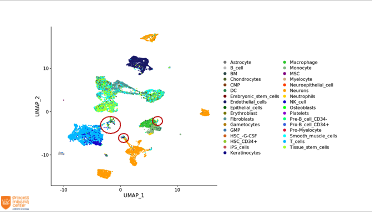

# Single cell RNA-seq data analysis with R

HAHA!

### [Schedule](schedule.md) <!-- note: this is the real thing -->

### Dates
Mon 24 Jan - Tue 25 Jan 2022

### Location
TODO

### Course computing environment
TODO

## Programme

TODO

### Prerequisities
In order to participate in this course you should have prior experience in using R.

### Learning objectives
After this course you will be able to:
- use a range of bioinformatics tools to analyze single cell RNA-seq data
- discuss a variety of aspects of single cell RNA-seq data analysis
- understand the advantages and limitations of single cell RNA-seq data analysis

### Lecturers
- TODO

### Additional information
- TODO
