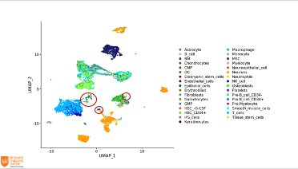

## Schedule

### Monday

- **09:00-11:00**	Lecture: [example lecture (empty)](session-example/example.pptx) (Philip Lijnzaad) [Video](https://www.youtube.com/watch?v=dQw4w9WgXcQ)
- **09:45-10:15** _coffee break_
- **10:15-11:00**	Handson: [Cell type identification](session-example/example.md), ([Rmd file](session-example/example.Rmd)) (Philip)

### Instructions on how to
- [launch the Conda environment](computing_environment_instructions.md) on the classroom computers
- [access the virtual machine image](computing_environment_instructions.md) in the cPouta cloud
- [install the Conda environment](conda_instructions.md) on your own computer after the course

## Lecturers
TODO

## Additional information
TODO

## [Back to main](README.md)
