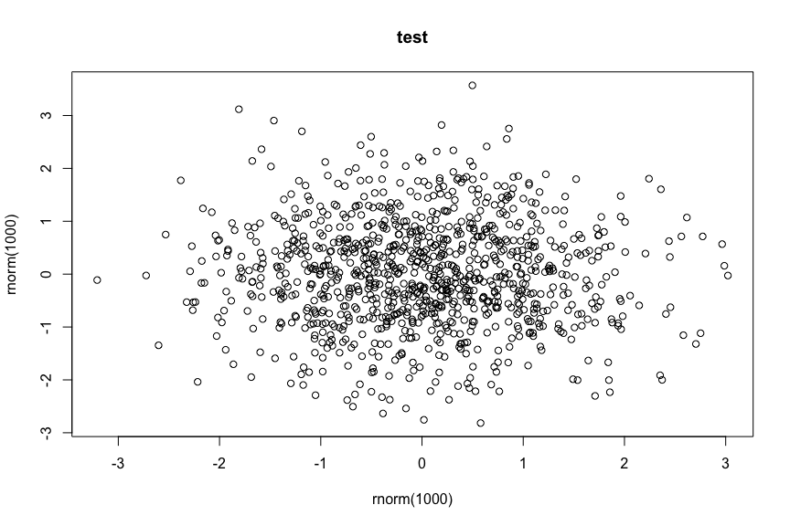

Cell type identification
================

Created by: Philip Lijnzaad

# Overview

asdfadsfasdf

# Datasets

asdfasdf

asdfasdf

``` r
suppressMessages(require(Seurat))
suppressMessages(require(CHETAH))
suppressMessages(require(Matrix))
suppressMessages(require(SingleR))
suppressMessages(require(cowplot))
```

Clearly, most of the cells are Macrophages.

We now follow the ‘standard’ [Seurat
workflow](https://satijalab.org/seurat/essential_commands.html#seurat-standard-worflow)
to prepare the data.

``` r
plot(x=rnorm(1000), y=rnorm(1000),main='test')
```

<!-- -->

qwerqwer

### Session info

``` r
sessionInfo()
```

    ## R version 4.1.0 (2021-05-18)
    ## Platform: x86_64-apple-darwin20.3.0 (64-bit)
    ## Running under: macOS Big Sur 11.2.3
    ## 
    ## Matrix products: default
    ## BLAS:   /Users/philiplijnzaad/local/Cellar/openblas/0.3.17/lib/libopenblasp-r0.3.17.dylib
    ## LAPACK: /Users/philiplijnzaad/local/Cellar/r/4.1.0/lib/R/lib/libRlapack.dylib
    ## 
    ## locale:
    ## [1] C
    ## 
    ## attached base packages:
    ## [1] stats4    stats     graphics  grDevices utils     datasets  methods   base     
    ## 
    ## other attached packages:
    ##  [1] cowplot_1.1.1               SingleR_1.8.0               Matrix_1.3-4                CHETAH_1.9.0                SingleCellExperiment_1.16.0 SummarizedExperiment_1.24.0 Biobase_2.54.0              GenomicRanges_1.46.0        GenomeInfoDb_1.30.0         IRanges_2.28.0              S4Vectors_0.32.2            BiocGenerics_0.40.0         MatrixGenerics_1.6.0        matrixStats_0.61.0          ggplot2_3.3.5               SeuratObject_4.0.3          Seurat_4.0.5               
    ## 
    ## loaded via a namespace (and not attached):
    ##   [1] corrplot_0.91             plyr_1.8.6                igraph_1.2.8              lazyeval_0.2.2            splines_4.1.0             BiocParallel_1.28.0       listenv_0.8.0             scattermore_0.7           digest_0.6.28             htmltools_0.5.2           viridis_0.6.2             fansi_0.5.0               magrittr_2.0.1            ScaledMatrix_1.2.0        tensor_1.5                cluster_2.1.2             ROCR_1.0-11               globals_0.14.0            spatstat.sparse_2.0-0     colorspace_2.0-2          ggrepel_0.9.1             xfun_0.28                 dplyr_1.0.7               crayon_1.4.2              RCurl_1.98-1.5            jsonlite_1.7.2            spatstat.data_2.1-0       survival_3.2-13           zoo_1.8-9                 glue_1.5.0                polyclip_1.10-0           gtable_0.3.0              zlibbioc_1.40.0           XVector_0.34.0            leiden_0.3.9              DelayedArray_0.20.0       BiocSingular_1.10.0       future.apply_1.8.1       
    ##  [39] abind_1.4-5               scales_1.1.1              pheatmap_1.0.12           DBI_1.1.1                 miniUI_0.1.1.1            Rcpp_1.0.7                viridisLite_0.4.0         xtable_1.8-4              reticulate_1.22           spatstat.core_2.3-1       rsvd_1.0.5                htmlwidgets_1.5.4         httr_1.4.2                gplots_3.1.1              RColorBrewer_1.1-2        ellipsis_0.3.2            ica_1.0-2                 pkgconfig_2.0.3           uwot_0.1.10               deldir_1.0-6              utf8_1.2.2                tidyselect_1.1.1          rlang_0.4.12              reshape2_1.4.4            later_1.3.0               munsell_0.5.0             tools_4.1.0               generics_0.1.1            ggridges_0.5.3            evaluate_0.14             stringr_1.4.0             fastmap_1.1.0             yaml_2.2.1                goftest_1.2-3             bioDist_1.66.0            knitr_1.36                fitdistrplus_1.1-6        caTools_1.18.2           
    ##  [77] purrr_0.3.4               RANN_2.6.1                dendextend_1.15.2         sparseMatrixStats_1.6.0   pbapply_1.5-0             future_1.23.0             nlme_3.1-153              mime_0.12                 compiler_4.1.0            plotly_4.10.0             png_0.1-7                 spatstat.utils_2.2-0      tibble_3.1.6              stringi_1.7.5             highr_0.9                 lattice_0.20-45           vctrs_0.3.8               pillar_1.6.4              lifecycle_1.0.1           spatstat.geom_2.3-0       lmtest_0.9-39             RcppAnnoy_0.0.19          BiocNeighbors_1.12.0      data.table_1.14.2         bitops_1.0-7              irlba_2.3.3               httpuv_1.6.3              patchwork_1.1.1           R6_2.5.1                  promises_1.2.0.1          KernSmooth_2.23-20        gridExtra_2.3             parallelly_1.28.1         codetools_0.2-18          MASS_7.3-54               gtools_3.9.2              assertthat_0.2.1          withr_2.4.2              
    ## [115] sctransform_0.3.2         GenomeInfoDbData_1.2.7    mgcv_1.8-38               parallel_4.1.0            beachmat_2.10.0           grid_4.1.0                rpart_4.1-15              tidyr_1.1.4               DelayedMatrixStats_1.16.0 rmarkdown_2.11            Rtsne_0.15                shiny_1.7.1

### [Back to main](../README.md)
